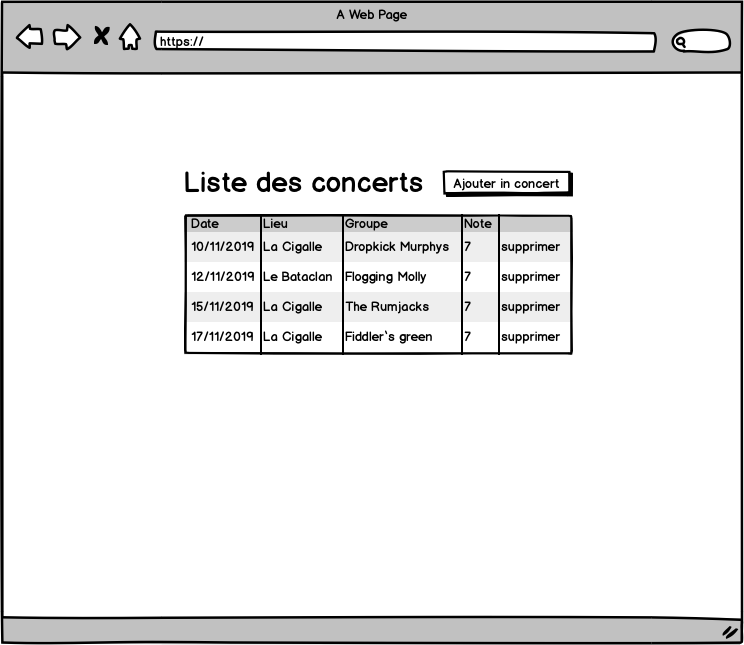
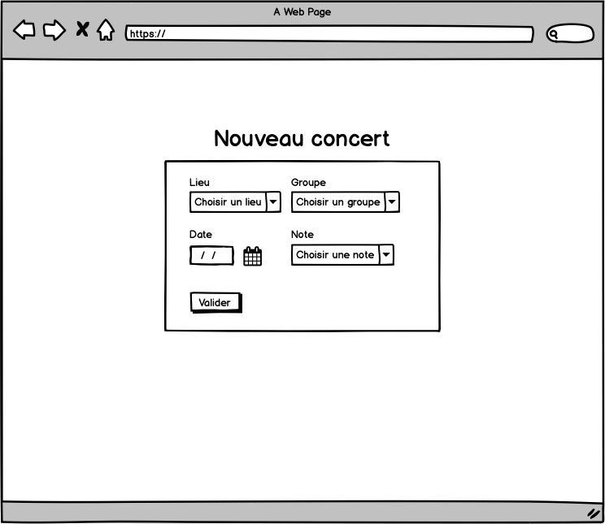

## Objectifs :

Réaliser une application comprenant un backend et un frontend selon les maquettes ci-dessous.

> Les notes vont de 1 à 10

# Stack
Vous avez toute latitude concernant les choix techniques, toutefois il est conseillé d'utiliser des langages et frameworks utilisés en cours, à savoir :

### frontend

- Ionic
- ReactJS
- jQuery

## backend

- Node.js
- Express

## BD

- Mysql
- MongoDB

# Restitution

Votre projet devra adopter la structure de dossier suivante

- votre-nom
  - frontend
  - backend
  - database (le script sql ou l'export json de votre BD)
  
Vous compresserez ce dossier au format zip et le restituerez le jour de la correction.  

# Bonus

Ces ponts ne seront pas évalués mais peuvent vous occuper si vous vous sentez oisif :-)

- Remplacer la liste déroulante des notes par un composant présentant 5 étoiles cliquables
- Afficher une page de statistiques présentant la moyenne des notes par lieu et par groupe